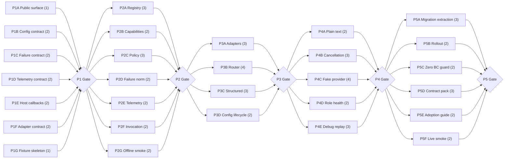

# LLM Endpoint Module Development Plan

> Source: `docs/design/design-260516-1331-llm-endpoint-module.md`
> Dev unit size: 0.5 developer-day
> Planning scope: 14 components, 5 phases, 7 max parallel tracks

## Planning Basis

This plan consumes the design components and sequencing constraints. It does not redefine architecture. Tracks map to component, contract, or release-artifact boundaries from the technical design.

Component boundaries used:

| Component | Plan Role |
|---|---|
| Public Invocation Facade | Public API and sync/async entrypoint track. |
| Registry & Config Validator | Config, registry, role/pool validation, activation, and identity track. |
| Runtime Policy Resolver | Policy, precedence, budget, and provenance track. |
| Capability Profile Catalog | Provider/model-family facts and evidence track. |
| Provider Adapter Layer | Adapter contract and provider outcome normalization track. |
| Secret Resolver Boundary | Host callback contract and credential failure track. |
| Schema Resolver & Validation Boundary | Schema identity, resolver, extraction, and validation track. |
| Deadline Pool Router | Candidate budget, suppression, failover, and late-response track. |
| Result & Failure Normalizer | Typed result/failure taxonomy track. |
| Telemetry & Debug Artifact Emitter | Redacted events, token usage, traces, and replay artifacts track. |
| Role Health Service | Deterministic role-health track. |
| Offline Smoke & Fake Provider Harness | Offline validation, fake scenarios, and conformance track. |
| Compatibility Guard | Public surface diff, semver, changelog, and migration-note enforcement track. |
| Migration Extraction | Direct-API migration guide and consumer fixture parity track; no compatibility facade. |

Execution rule:

```text
Same-phase tracks depend only on the prior phase gate or on the source design.
Integration between same-phase tracks is verified by the phase gate, not modeled as hidden track-to-track dependency.
```

## Phase 1: Public Contracts Foundation

| Track | Components / Contracts | Owner | Deliverables | Dev Units | Depends On |
|---|---|---|---|---:|---|
| P1A | Public surface manifest | Module maintainer | Public/internal boundary inventory for API, config, telemetry, failure taxonomy, validation, fake provider, and adapter extension under Zero BC | 1 | Design |
| P1B | Configuration and registry schema | Registry owner | Versioned config shape, endpoint UID rules, role/pool shape, operation policy refs, capability refs, schema refs, credential refs, config identity contract | 2 | Design |
| P1C | Failure taxonomy and result contract | Runtime owner | Typed success, plain text success, typed failure envelope, retryability flags, safe diagnostics, terminal outcome rules | 2 | Design |
| P1D | Telemetry and redaction envelope | Observability owner | Event family schema, required common fields, forbidden fields, redaction status, token usage placeholder, attempt trace identity | 2 | Design |
| P1E | Host callback contracts | Integration owner | `resolve_secret(ref)` and `resolve_schema(ref)` contracts, redacted credential failure, schema version/fingerprint contract | 2 | Design |
| P1F | Provider adapter extension contract | Adapter owner | Provider-format adapter input/output contract, normalized provider outcome contract, capability evidence requirements | 2 | Design |
| P1G | Contract fixture skeleton | Test owner | Golden fixture layout for config, telemetry, failures, policy, fake provider, router, structured output, and adapter parity | 1 | Design |

**Gate:** Public contract fixtures exist and every public surface has owner, Zero BC compatibility level, versioning rule, and positive/negative fixture skeleton coverage.

**Failure blocker:** Parallel implementation cannot begin if public contracts are ambiguous, any compatibility shim is present, or fixture skeletons do not cover config, errors, telemetry, provider outcomes, schema, and secrets.

**Gate result:** Passed on 2026-05-16.

| Check | Evidence |
|---|---|
| Public surface manifest | `llm_endpoint.public_surface.PUBLIC_SURFACES` lists owned Zero BC surfaces only. |
| Fixture coverage | `tests/contracts/test_public_surface.py::test_every_public_surface_has_fixture_coverage` requires positive and negative fixtures for every public surface. |
| Contract areas | `llm_endpoint.fixtures.CONTRACT_FIXTURES` covers config, telemetry, failures, policy, fake provider, router, structured output, and adapter parity. |
| Quality command | `uv run pytest tests/contracts` -> `20 passed`. |
| BC policy | No migration facade or compatibility shim is part of the Phase 1 public surface. |

## Phase 2: Core Planning Spine

| Track | Components / Contracts | Owner | Deliverables | Dev Units | Depends On |
|---|---|---|---|---:|---|
| P2A | Registry & Config Validator | Registry owner | Offline config validation, role/pool resolution, UID invariants, unsupported provider/model-family failures, config identity output | 3 | P1 Gate |
| P2B | Capability Profile Catalog | Adapter owner | Provider-format/model-family profile model, conservative unknown-family behavior, capability evidence metadata, hard limit lookup | 2 | P1 Gate |
| P2C | Runtime Policy Resolver | Runtime owner | Policy precedence, hard-cap enforcement, override validation, effective runtime config provenance, policy fingerprint | 3 | P1 Gate |
| P2D | Result & Failure Normalizer | Runtime owner | Stable failure construction, retryability classification, safe provider status mapping, terminal outcome consistency | 2 | P1 Gate |
| P2E | Telemetry Emitter | Observability owner | Registry/policy/invocation event emission, attempt trace skeleton, redaction enforcement, token usage field handling | 2 | P1 Gate |
| P2F | Public Invocation Facade | API owner | Canonical invocation input validation, operation invocation ID handling, sync/async surface contract, no-provider-call planning path | 2 | P1 Gate |
| P2G | Offline Smoke API Shell | Test owner | Offline smoke command/API shape, fixture runner, machine-readable result envelope, no-network/no-secret execution boundary | 2 | P1 Gate |

**Gate:** A host can validate config offline, resolve a role and policy, produce effective runtime config provenance, emit redacted validation/policy telemetry, and receive typed failures for invalid inputs without live providers.

**Failure blocker:** Execution components remain blocked if registry, capability, policy, failure, and telemetry contracts are not integrated through the public invocation facade.

**Gate result:** Passed on 2026-05-16.

| Check | Evidence |
|---|---|
| P2A registry/config validator | `llm_endpoint.config.build_registry`, `Registry.resolve_role`, and `Registry.resolve_operation_policy` validate and index config offline with deterministic `config_identity`. |
| P2B capability catalog | `llm_endpoint.capabilities.DEFAULT_CAPABILITY_CATALOG` provides provider-format/model-family facts, evidence metadata, hard limits, and fail-closed unknown-family lookup. |
| P2C runtime policy resolver | `llm_endpoint.policy.resolve_policy` resolves effective runtime config, provenance, policy fingerprint, override validation, hard-cap enforcement, and redacted `llm.policy.resolved` telemetry. |
| P2D result/failure normalizer | `llm_endpoint.normalization.normalize_provider_outcome` maps provider outcomes to one public terminal result with stable retryability, failure class, safe provider status, and no raw payload leakage. |
| P2E telemetry emitter | `llm_endpoint.telemetry.TelemetryEmitter` captures and best-effort forwards redacted registry, policy, failure, and smoke events without corrupting terminal outcomes. |
| P2F public invocation facade | `llm_endpoint.invocation.invoke_plan` validates canonical direct invocation input, handles operation invocation IDs, resolves registry/policy/schema refs, and returns a no-provider-call `InvocationPlan` or typed failure. |
| P2G offline smoke API shell | `llm_endpoint.smoke.run_offline_smoke` returns a machine-readable `OfflineSmokeReport` for config, registry, invocation planning, and telemetry checks without network calls or secret resolution. |
| Zero BC policy | New public surfaces are direct `v1` clean-slate contracts; no version routers, deprecated fields, compatibility adapters, or legacy precedence paths were added. |
| Quality commands | `uv run ruff check .` -> passed; `uv run pytest tests/contracts` -> `37 passed`. |

## Phase 3: Execution Components

| Track | Components / Contracts | Owner | Deliverables | Dev Units | Depends On |
|---|---|---|---|---:|---|
| P3A | Provider Adapter Layer | Adapter owner | First required provider-format adapters, credential resolution integration, normalized provider outcomes, token usage extraction when available | 3 | P2 Gate |
| P3B | Deadline Pool Router | Runtime owner | Candidate budget allocator, ordered failover, retryable-only fallback, suppression skip reason, protect-last-eligible behavior, pool exhaustion | 4 | P2 Gate |
| P3C | Structured Output Pipeline | Schema owner | Schema resolver integration, extraction modes, refusal handling, invalid payload failure, schema fingerprint telemetry, validation handoff | 3 | P2 Gate |
| P3D | Config Lifecycle & Activation | Registry owner | Active registry lifecycle, full replacement validation semantics, config identity exposure, failed-replacement behavior, rollback-by-identity contract | 2 | P2 Gate |

**Gate:** Provider attempts, routing, structured-output planning, active config identity, and telemetry/failure normalization integrate through the canonical invocation path without hidden provider payload leakage.

**Failure blocker:** Invocation hardening remains blocked if adapter outcomes, router terminal states, schema validation, or config activation semantics cannot produce the public result/failure contract.

## Phase 4: Invocation Hardening

| Track | Components / Contracts | Owner | Deliverables | Dev Units | Depends On |
|---|---|---|---|---:|---|
| P4A | Plain Text Path | API owner | Plain text result path with deadline, policy, provider normalization, telemetry, and typed failures without fake schemas | 2 | P3 Gate |
| P4B | Cancellation & Late Response Semantics | Runtime owner | Caller cancellation handling, no fallback after cancellation, local timeout terminal behavior, late-response discard telemetry | 3 | P3 Gate |
| P4C | Fake Provider Harness | Test owner | Deterministic fixtures for rate limit, quota, timeout, transient network, 5xx, refusal, malformed JSON, wrong tool, duplicate terminal tool, schema violation, late response, cancellation, pool exhaustion | 4 | P3 Gate |
| P4D | Role Health Service | Operations owner | Available, degraded, fallback_only, missing_secret, failing_smoke, uncertified, suppressed, unavailable states with deterministic reason list | 2 | P3 Gate |
| P4E | Debug Replay Artifacts | Observability owner | Redacted endpoint plan, policy provenance, capability profile, schema trace, attempt trace, typed failure, fake-provider reproduction hook | 3 | P3 Gate |

**Gate:** Deterministic fake-provider tests prove structured/plain invocation, retryable failover, non-retryable fail-fast, cancellation, late response discard, suppression routing, pool exhaustion, role health, debug artifacts, and telemetry redaction.

**Failure blocker:** Migration and broad consumer adoption cannot start if terminal outcomes, fake-provider scenarios, role health, or debug artifacts are not deterministic and redacted.

## Phase 5: Operator Readiness & Adoption

| Track | Components / Contracts | Owner | Deliverables | Dev Units | Depends On |
|---|---|---|---|---:|---|
| P5A | Migration Extraction | Migration owner | Direct-API migration guide, consumer call-site checklist, version-pin rollback steps, fixture parity requirements | 3 | P4 Gate |
| P5B | Rollout Controls | Operations owner | Enable/disable by UID, force candidate in test mode, canary identification by role/operation, policy fingerprint comparison | 2 | P4 Gate |
| P5C | Zero BC Guard | Module maintainer | Public surface checks for API/config/telemetry/failure taxonomy plus shim/legacy-route rejection | 2 | P4 Gate |
| P5D | Consumer Contract Test Pack | Test owner | Installable fixtures for config validation, failure taxonomy, telemetry redaction, structured output, pool simulation, plain text, and direct-API parity | 3 | P4 Gate |
| P5E | Extraction & Adoption Guide | Migration owner | Consumer migration guide, pinning strategy, host responsibilities checklist, rollback levers, non-V1 exclusions | 2 | P4 Gate |
| P5F | Optional Live Smoke Boundary | Operations owner | Explicit live smoke contract, safe minimal payloads, redacted result reporting, typed skipped/failed outcomes | 2 | P4 Gate |

**Gate:** A consuming repo can pin the module, configure roles/operations, run offline validation and contract tests without credentials, exercise fake-provider failure cases, query role health, inspect safe debug artifacts, and roll out or roll back via documented steps.

**Failure blocker:** Production-default adoption remains blocked if direct-API migration parity, rollout controls, Zero BC checks, consumer contract pack, adoption guide, or optional live smoke boundary is missing or unredacted.

## Summary Table

| Phase | Tracks | Total Dev Units | Gate Criteria |
|---|---|---:|---|
| Phase 1 | P1A public surface, P1B config, P1C failures, P1D telemetry, P1E callbacks, P1F adapters, P1G fixtures | 12 | Fixture-backed public contracts are owned, versioned, and Zero BC. |
| Phase 2 | P2A registry, P2B capabilities, P2C policy, P2D failures, P2E telemetry, P2F invocation, P2G offline smoke | 16 | Offline validation, role/policy resolution, provenance, and redacted telemetry work without live providers. |
| Phase 3 | P3A adapters, P3B router, P3C structured output, P3D config lifecycle | 12 | Provider execution components integrate without leaking raw provider payloads. |
| Phase 4 | P4A plain text, P4B cancellation, P4C fake provider, P4D role health, P4E debug replay | 14 | Fake-provider scenarios prove terminal outcomes, role health, debug artifacts, and redaction. |
| Phase 5 | P5A migration extraction, P5B rollout, P5C Zero BC guard, P5D contract pack, P5E adoption, P5F live smoke | 14 | Consumers can validate, test, inspect, migrate, roll out, and roll back safely. |
| **Total** | 29 tracks | **68** | Cross-repo V1 ready for controlled adoption. |

## Metrics

| Metric | Value |
|---|---:|
| Total dev units | 68 |
| Max parallel tracks | 7 |
| Phases | 5 |
| Critical path length | 16 dev units |

Critical path: P1B/P1F contracts -> P2C policy -> P3B router -> P4C fake provider -> P5D consumer contract pack.

## Dependency Graph



## Track Independence Rules

| Rule | Enforcement |
|---|---|
| Same-phase tracks depend only on the source design or the previous phase gate. | Any work needing another same-phase track is pushed into the next phase or into the phase gate. |
| No track crosses component ownership lines. | Integration tasks appear as gates or later tracks. |
| Test-only fixtures are counted only when they deliver reusable contract or fake-provider artifacts. | Phase 1, Phase 4, and Phase 5 fixture work produces public conformance assets. |
| Documentation-only work is counted only when it is a release/adoption artifact required by the design. | Phase 5 adoption guide is a rollout deliverable, not planning overhead. |

## Blockers & Open Questions

| Blocker / Question | Owner | Impact |
|---|---|---|
| First required provider-format set is not finalized. | Consuming repo owners | P3A adapter scope and P2B capability profiles may change. |
| Canonical schema fingerprint format is not finalized. | Module maintainer | P1E, P3C, telemetry fixtures, and debug artifacts need stable identity. |
| Sync/async cancellation representation is not finalized. | Module maintainer | P2F and P4B public API fixtures may split by API style. |
| Exact Nightfall direct-API migration inventory is not selected. | Nightfall owner + module maintainer | P5A scope must stay narrow and avoid facade support. |
| Distribution path is not selected. | Module maintainer | P5E pinning and rollback guidance remains provisional. |
| Runtime config reload need is not confirmed. | Module maintainer + consuming repo owners | If required, P3D must implement explicit validated replacement; otherwise reload remains non-V1. |

## Validation Gates

| Gate | Observable Pass Criteria |
|---|---|
| P1 Gate | Public surface manifest and fixture skeleton cover API, config, telemetry, failure taxonomy, host callbacks, and provider adapter under Zero BC. |
| P2 Gate | Offline validation resolves registry, policy, provenance, and typed failures without network or credentials. |
| P3 Gate | Provider adapters, router, structured output, config lifecycle, telemetry, and typed failures integrate through canonical invocation. |
| P4 Gate | Fake providers prove structured/plain result paths, retryable failover, non-retryable fail-fast, cancellation, late-response discard, suppression, role health, debug artifacts, pool exhaustion, and redaction. |
| P5 Gate | Consumer contract pack, migration extraction, rollout controls, Zero BC checks, adoption guide, and optional live smoke are release-ready. |

## Revision Log

| Date | Change |
|---|---|
| 2026-05-16 | Passed Phase 2 gate by adding result normalization, telemetry emitter, direct invocation planning facade, offline smoke API shell, and contract coverage. |
| 2026-05-16 | Passed Phase 1 gate, added gate evidence, and aligned the plan to Zero BC with no migration facade. |
| 2026-05-16 | Tightened the plan for true same-phase independence: corrected component count, split dependent execution work into five phases, added config lifecycle, Zero BC guard, revised metrics, and replaced the dependency graph. |
| 2026-05-16 | Initial development plan derived from technical design. |
