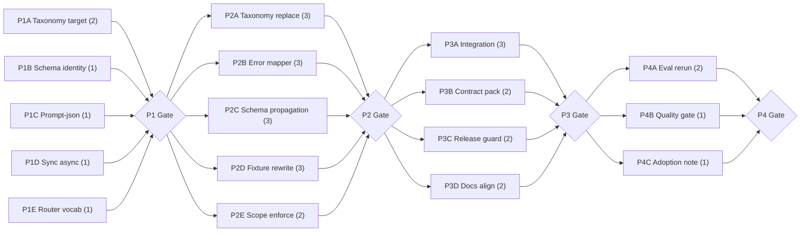

# LLM Endpoint PRD Compliance Remediation Plan

> Source: `docs/design/design-260516-2208-prd-compliance-remediation.md`
> Dev unit size: 0.5 developer-day
> Planning scope: 10 remediation components, 4 phases, 6 max parallel tracks
> Baseline: `docs/plan/plan-260516-1331-llm-endpoint-module.md` is already implemented and archived as the completed base plan.

## Planning Basis

This is a follow-up remediation plan. It does not reopen the completed base implementation plan. Work starts from the implemented module and the eval findings in `eval/sessions/260516-1743-prd-design-compliance-audit/report.md`.

Component boundaries used:

| Component | Plan Role |
|---|---|
| Failure Taxonomy Contract | Exact PRD `llm.*` public codes, retryability, failure class, and specific code mapping. |
| Failure Context Model | Schema identity fields on structured failures. |
| Telemetry Context Model | Schema identity and failure details on structured failure events. |
| Invocation & Policy Error Mapper | Specific PRD codes for input, role, operation, policy, budget, and capability failures. |
| Structured Failure Pipeline | Schema-aware structured failure propagation. |
| Contract Fixture Pack | Public string/code and telemetry field assertions. |
| Structured Mode Scope Gate | `prompt_json` full-V1 support and enforcement. |
| Async Contract Boundary | Sync-only V1 decision and documentation. |
| Router Policy Vocabulary | `protect_last_eligible` public vocabulary alignment. |
| Release Guard | New clean-slate baseline for corrected public surfaces. |

Execution rule:

```text
Do not mutate the completed base plan.
Do not add compatibility aliases.
Every remediation track must end in public contract fixtures.
```

## Phase 1: Contract Decisions

| Track | Components / Contracts | Owner | Deliverables | Dev Units | Depends On |
|---|---|---|---|---:|---|
| P1A | Failure taxonomy target | Runtime owner | PRD code mapping table, retryability/class mapping, replacement rule for compact codes | 2 | Remediation design |
| P1B | Schema identity contract | Schema owner + Observability owner | Required fields for structured typed failures and structured failure telemetry | 1 | Remediation design |
| P1C | `prompt_json` scope | Schema owner + Module maintainer | Decision record: implement full V1 mode | 1 | Remediation design |
| P1D | Sync/async contract | API owner | Decision record: sync-only V1 with cancellation semantics | 1 | Remediation design |
| P1E | Router vocabulary | Runtime owner | Decision record: `protect_last_eligible` is canonical policy | 1 | Remediation design |

**Gate:** All public-contract decisions are explicit, Zero BC, and mapped to fixture expectations before implementation changes begin.

**Failure blocker:** Phase 2 cannot start if any decision would require compatibility aliases, deprecated code preservation, or conflicting public vocabulary.

## Phase 2: Public Contract Replacement

| Track | Components / Contracts | Owner | Deliverables | Dev Units | Depends On |
|---|---|---|---|---:|---|
| P2A | Failure taxonomy replacement | Runtime owner | Public failure codes use exact PRD `llm.*` values; retryability and failure-class mappings updated | 3 | P1 Gate |
| P2B | Specific error mapping | API owner + Runtime owner | Input, unknown role, unknown operation, policy, budget, endpoint, and pool failures map to specific PRD codes | 3 | P1 Gate |
| P2C | Schema identity propagation | Schema owner + Observability owner | Structured failures and failure events carry schema ref and fingerprint/status when available | 3 | P1 Gate |
| P2D | Contract fixture rewrite | Test owner | Golden fixtures assert public code strings, structured failure schema fields, and redaction invariants | 3 | P1 Gate |
| P2E | Scope/vocabulary enforcement | Module maintainer | `prompt_json`, sync/async, and router vocabulary decisions reflected in public docs, config validation, and public surface manifest | 2 | P1 Gate |

**Gate:** Corrected public contracts pass focused contract tests, and no old compact failure code values remain as public fixture expectations.

**Failure blocker:** Phase 3 cannot start if tests still assert implementation-local enum identity as the primary contract or if old code aliases remain.

## Phase 3: Integration & Guarding

| Track | Components / Contracts | Owner | Deliverables | Dev Units | Depends On |
|---|---|---|---|---:|---|
| P3A | Router and structured integration | Runtime owner + Schema owner | End-to-end structured failures, pool failures, deadline/cancellation failures, and provider failures emit corrected typed failure + telemetry payloads | 3 | P2 Gate |
| P3B | Consumer contract pack update | Test owner | Contract pack covers corrected taxonomy, schema-aware failures, selected mode/sync decisions, and router vocabulary | 2 | P2 Gate |
| P3C | Release guard baseline | Module maintainer | Public surface baseline/changelog evidence treats corrected taxonomy and telemetry schema as the clean-slate baseline | 2 | P2 Gate |
| P3D | Documentation alignment | Docs owner | PRD/design/plan/adoption references no longer contradict implementation status for `prompt_json`, sync/async, or router vocabulary | 2 | P2 Gate |

**Gate:** Full contract suite passes, release guard accepts the new clean-slate baseline, and documentation states one public truth for each corrected surface.

**Failure blocker:** Phase 4 cannot start if consumer fixtures, release guard, or docs still preserve the pre-remediation contract.

## Phase 4: Final Compliance Verification

| Track | Components / Contracts | Owner | Deliverables | Dev Units | Depends On |
|---|---|---|---|---:|---|
| P4A | PRD compliance audit rerun | Module maintainer | Updated eval report or new eval session proving all prior findings are closed or explicitly downgraded by documented scope decision | 2 | P3 Gate |
| P4B | Full quality gate | Module maintainer | `ruff`, full contract tests, and public-surface release guard pass together | 1 | P3 Gate |
| P4C | Adoption readiness note | Migration owner | Consumer-facing note identifying the corrected public-surface changes and required Zero BC edits | 1 | P3 Gate |

**Gate:** Repo can be described as PRD-compliant for the declared sync-only V1 scope.

**Failure blocker:** Do not claim native async support; V1 is sync-only and host async wrapping is outside the module contract.

## Summary Table

| Phase | Tracks | Total Dev Units | Gate Criteria |
|---|---|---:|---|
| Phase 1 | P1A taxonomy, P1B schema identity, P1C prompt-json, P1D sync/async, P1E router vocabulary | 6 | Public decisions are explicit and Zero BC. |
| Phase 2 | P2A taxonomy replacement, P2B error mapper, P2C schema propagation, P2D fixtures, P2E scope enforcement | 14 | Corrected contracts pass focused tests with no alias debt. |
| Phase 3 | P3A integration, P3B consumer pack, P3C release guard, P3D docs | 9 | Full suite, release guard, and docs agree on one public contract. |
| Phase 4 | P4A eval rerun, P4B quality gate, P4C adoption note | 4 | PRD compliance status is proven for declared scope. |
| **Total** | 17 tracks | **33** | Public-contract drift closed or explicitly scoped. |

## Metrics

| Metric | Value |
|---|---:|
| Total dev units | 33 |
| Max parallel tracks | 6 |
| Phases | 4 |
| Critical path length | 10 dev units |

Critical path: P1A taxonomy target -> P2A/P2B taxonomy replacement + mapper -> P3A integration -> P4A eval rerun.

## Dependency Graph



## Track Independence Rules

| Rule | Enforcement |
|---|---|
| Phase 1 decisions are independent but all must complete before public contract replacement. | No implementation track starts before P1 Gate. |
| Phase 2 tracks share only the P1 decisions and source design. | Integration between taxonomy, schema, fixtures, and docs is verified at P2 Gate. |
| Phase 3 tracks consume corrected contracts only. | No Phase 3 track preserves pre-remediation values. |
| Phase 4 is verification and adoption proof. | It cannot add new behavior except documentation of compliance status. |

## Blockers & Open Questions

| Blocker / Question | Owner | Impact |
|---|---|---|
| `prompt_json` support. | Module maintainer | Resolved: implemented as V1 structured-output mode with contract tests. |
| Sync/async V1 shape. | Module maintainer | Resolved: sync-only V1; host-owned async wrapping is outside scope. |
| Router vocabulary. | Runtime owner | Resolved: `protect_last_eligible` is canonical and numeric reserve vocabulary is removed. |
| Taxonomy completeness level. | Module maintainer | Resolved: public taxonomy contains the PRD code set; reachable behaviors are contract-tested. |

## Validation Gates

| Gate | Observable Pass Criteria |
|---|---|
| P1 Gate | Decision records exist for taxonomy, schema identity, prompt JSON, sync/async, and router vocabulary. |
| P2 Gate | Focused tests prove exact PRD public codes, schema-aware structured failures, and no public alias debt. |
| P3 Gate | Full contract suite, consumer fixture pack, release guard, and docs all agree on corrected public surfaces. |
| P4 Gate | New or updated eval evidence confirms findings are closed for the declared sync-only V1 scope. |

## Revision Log

| Date | Change |
|---|---|
| 2026-05-16 | Initial remediation plan created after archiving the completed base implementation plan. |
| 2026-05-16 | Final gate completed with `prompt_json`, sync-only V1, `protect_last_eligible`, quality gates, and eval evidence. |
